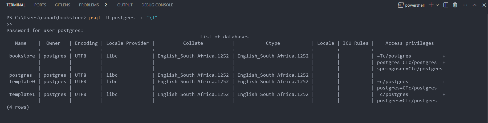
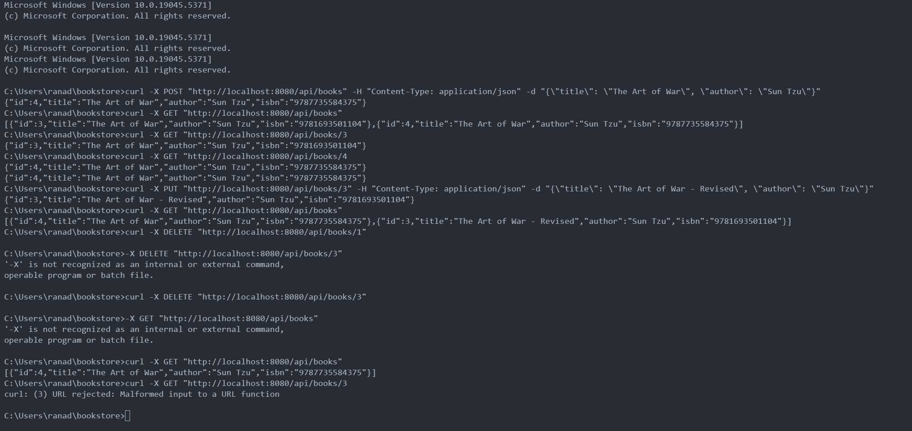
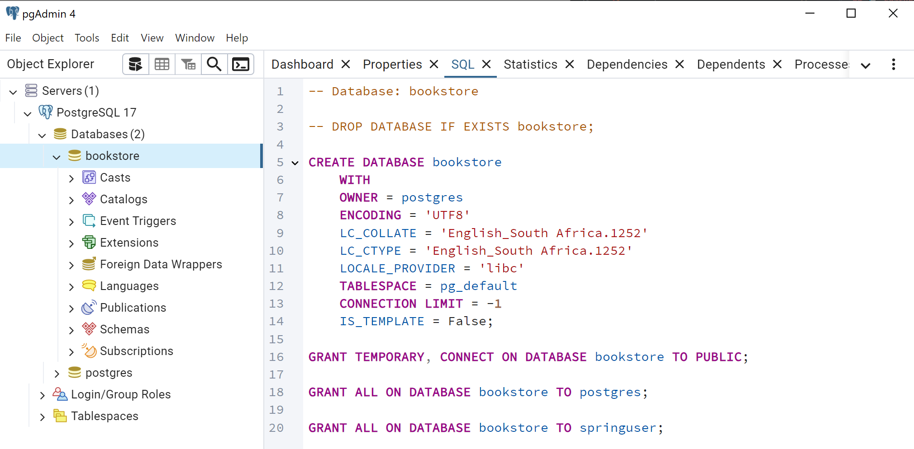

# **📚 Bookstore REST API**  
A **RESTful API** for managing books, built with **Java, Spring Boot, JPA, Hibernate, and PostgreSQL**.  

## 🚀 Features  
✅ Create, Read, Update, and Delete (CRUD) books 📖  
✅ Automatically generates **ISBN numbers** 📚  
✅ Uses **PostgreSQL** for database storage 🗄️  
✅ **Spring Boot & JPA** for easy ORM management 🔧  
✅ Built-in **data validation** with Jakarta Validation 🎯  

---

## **🛠 Technologies Used**  
| Tech Stack  | Description |
|------------|-------------|
| **Java 17**  | Core programming language  |
| **Spring Boot 3**  | Framework for REST API development  |
| **Spring Data JPA**  | ORM (Object Relational Mapping) for database interaction  |
| **PostgreSQL**  | Relational database system  |
| **Lombok**  | Reduces boilerplate code  |
| **Maven**  | Build & dependency management tool  |
| **JUnit & Mockito**  | Testing framework for unit testing  |

---

## **📌 Setup Instructions**  

### **1️⃣ Install & Configure PostgreSQL**  
Ensure **PostgreSQL** is installed and running.  
Create a new database:  
```sql
CREATE DATABASE bookstore;
```
👉 **Default PostgreSQL credentials:**  
- **Username:** `postgres`  
- **Password:** `yourpassword`  

---

### **2️⃣ Clone the Project**  
```sh
git clone https://github.com/ShiftAlpha/bookstore.git
cd bookstore
```

---

### **3️⃣ Configure Application Properties**  
Edit the **`application.properties`** file (`src/main/resources/application.properties`) with your **PostgreSQL credentials**:  
```properties
# Spring Boot Application Name
spring.application.name=bookstore

# Database Configuration (PostgreSQL)
spring.datasource.url=jdbc:postgresql://localhost:5432/bookstore
spring.datasource.username=postgres
spring.datasource.password=yourpassword
spring.datasource.driver-class-name=org.postgresql.Driver

# Hibernate (JPA) Configuration
spring.jpa.database-platform=org.hibernate.dialect.PostgreSQLDialect
spring.jpa.hibernate.ddl-auto=update
spring.jpa.show-sql=true
```

---

### **4️⃣ Build & Run the Project**  

#### **🔹 Using Maven (Recommended)**  
```sh
mvn clean install
mvn spring-boot:run
```
or directly:
```sh
./mvnw spring-boot:run
```

#### **🔹 Running in Docker (Optional)**
If you have **Docker**, you can run the PostgreSQL database using:  
```sh
docker run --name bookstore-db -e POSTGRES_USER=postgres -e POSTGRES_PASSWORD=yourpassword -p 5432:5432 -d postgres
```

---

## **📖 API Endpoints**  

| Method | Endpoint          | Description |
|--------|-------------------|-------------|
| `GET`  | `/api/books`      | Retrieve all books 📚 |
| `GET`  | `/api/books/{id}` | Retrieve a single book by ID 🔍 |
| `POST` | `/api/books`      | Create a new book 📝 |
| `PUT`  | `/api/books/{id}` | Update an existing book ✏️ |
| `DELETE` | `/api/books/{id}` | Delete a book ❌ |

---

## **🔬 Running Tests**  
To execute unit tests, run:  
```sh
mvn test
```

---

## **👨‍💻 Example API Requests**  

### **1️⃣ Create a New Book (POST)**
```sh
curl -X POST "http://localhost:8080/api/books" \
-H "Content-Type: application/json" \
-d '{
  "title": "The Art of War",
  "author": "Sun Tzu"
}'
```
📌 **Response**:
```json
{
  "id": 1,
  "title": "The Art of War",
  "author": "Sun Tzu",
  "isbn": "9781234567890"
}
```

### **2️⃣ Retrieve All Books (GET)**
```sh
curl -X GET "http://localhost:8080/api/books"
```

### **3️⃣ Retrieve a Book by ID (GET)**
```sh
curl -X GET "http://localhost:8080/api/books/1"
```

### **4️⃣ Update a Book (PUT)**
```sh
curl -X PUT "http://localhost:8080/api/books/1" \
-H "Content-Type: application/json" \
-d '{
  "title": "The Art of War - Revised",
  "author": "Sun Tzu"
}'
```

### **5️⃣ Delete a Book (DELETE)**
```sh
curl -X DELETE "http://localhost:8080/api/books/1"
```

---

## **📌 Project Structure**  
```
bookstore/
│── src/
│   ├── main/
│   │   ├── java/com/bookstore/
│   │   │   ├── controller/BookController.java
│   │   │   ├── model/Book.java
│   │   │   ├── repository/BookRepository.java
│   │   │   ├── service/BookService.java
│   │   │   ├── util/ISBNGenerator.java
│   │   ├── resources/application.properties
│   ├── test/java/com/bookstore/
│       ├── BookstoreApplicationTests.java
│       ├── service/BookServiceTest.java
│── pom.xml
│── README.md
│── mvnw (Maven Wrapper)
│── .gitignore
```

---

## **📜 License**
This project is **open-source** and available under the **MIT License**.

---


## 📸 Screenshots & Screen Recordings  

### 🔹 First Command Execution  
  

### 🔹 Screen Recording 1  
[](screenshots/2025-02-04-19-45-29.mp4)  

### 🔹 Screen Recording 2  
[](screenshots/2025-02-04-19-50-08.mp4)  

### 🔹 Command Execution  
  

### 🔹 pgAdmin4 Screenshot of SQL Execution  
  
